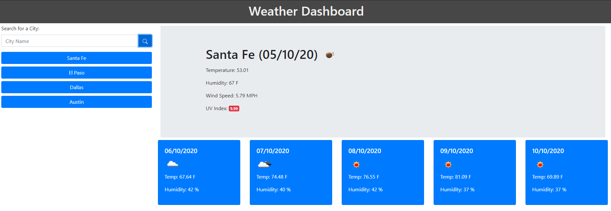

# FSB-WeatherDash

## Purpose:
The purpose of this program is to get the current and 5 day weather forecast of a given city based on the following items
<ul>
<li>When a User searches a given city
<li>Or when they reopen the page via last city searched from localStorage
</ul>

## Languages Used:
JQuery, Openweathermap API, and MomentJS library

### Psuedo Example:
User is presented with a page, left side displays a search bar and button, the right side displays an example of data to be pulled when they search for a city
Once a city has been searched a button linking to the city will be created on the left side under the search bar and on the right hand side will be displayed the current weather as well as a five day forecast

The UV index of the current weather will be color coded based on severity, and the forecast will hav an icon representation of the weather

#### Live website link:
https://grimmedev.github.io/FSB-WeatherDash/

#### Example image:

##### License
The MIT License
Copyright (c) 2020 Robert Grimes

Permission is hereby granted, free of charge, to any person obtaining a copy of this software and associated documentation files (the "Software"), to deal in the Software without restriction, including without limitation the rights to use, copy, modify, merge, publish, distribute, sublicense, and/or sell copies of the Software, and to permit persons to whom the Software is furnished to do so, subject to the following conditions:

The above copyright notice and this permission notice shall be included in all copies or substantial portions of the Software.

THE SOFTWARE IS PROVIDED "AS IS", WITHOUT WARRANTY OF ANY KIND, EXPRESS OR IMPLIED, INCLUDING BUT NOT LIMITED TO THE WARRANTIES OF MERCHANTABILITY, FITNESS FOR A PARTICULAR PURPOSE AND NONINFRINGEMENT. IN NO EVENT SHALL THE AUTHORS OR COPYRIGHT HOLDERS BE LIABLE FOR ANY CLAIM, DAMAGES OR OTHER LIABILITY, WHETHER IN AN ACTION OF CONTRACT, TORT OR OTHERWISE, ARISING FROM, OUT OF OR IN CONNECTION WITH THE SOFTWARE OR THE USE OR OTHER DEALINGS IN THE SOFTWARE.